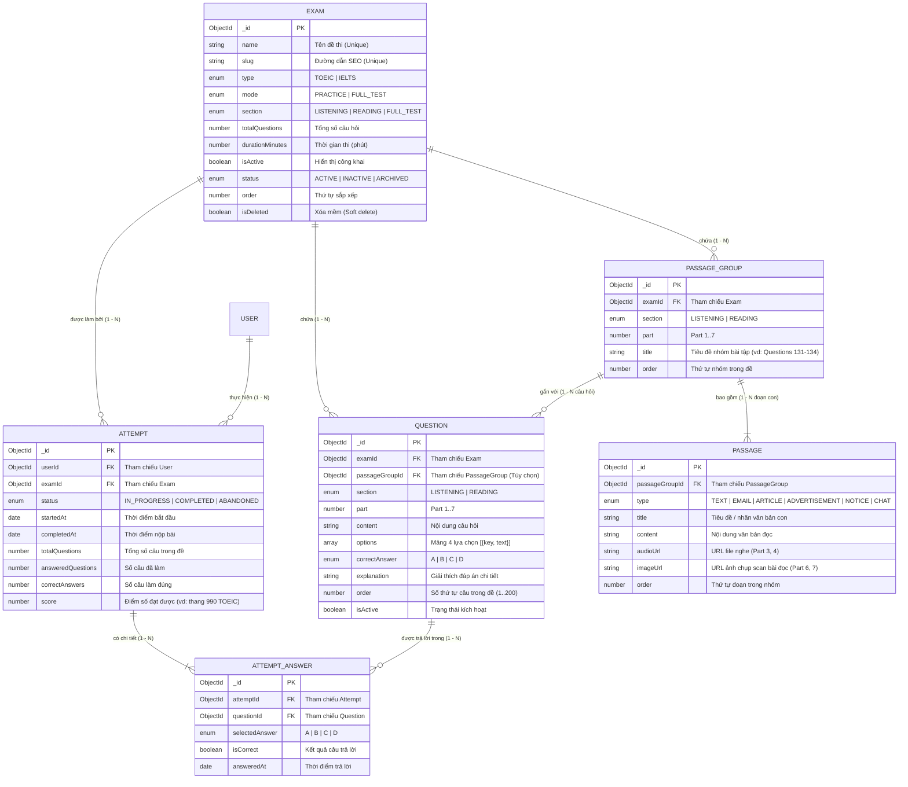

# CẤU TRÚC DỮ LIỆU CƠ SỞ DỮ LIỆU (DATABASE SCHEMA) - MODULE ASSESSMENT

Tài liệu này mô tả chi tiết toàn bộ cấu trúc dữ liệu, quan hệ liên kết (Entity-Relationship) và ý nghĩa từng trường dữ liệu thuộc phân hệ thi & kiểm tra đánh giá (**Assessment Module**) của hệ thống học tiếng Anh (TOEIC / IELTS).

Đường dẫn thư mục nguồn: `apps/api/src/modules/assessment`

---

## 1. TỔNG QUAN CÁC COLLECTION VÀ SƠ ĐỒ THỰC THỂ (ERD)

Phân hệ Assessment quản lý 6 thực thể chính được chia thành 3 nhóm nghiệp vụ:
1. **Đề thi (Exams)**: Lưu trữ thông tin chung của bài thi, chế độ làm bài, thời gian, trạng thái.
2. **Ngân hàng đề & Ngữ cảnh (Questions & Passages)**:
   - `PassageGroup`: Cụm nhóm bài tập đọc/nghe (VD: Nhóm câu hỏi 131-134 của Part 6, nhóm bài đọc đơn/kép/ba của Part 7, nhóm hội thoại Part 3/4).
   - `Passage`: Các đoạn văn bản / file nghe / hình ảnh bài đọc cụ thể nằm trong `PassageGroup`.
   - `Question`: Câu hỏi trắc nghiệm (gồm nội dung, 4 phương án A/B/C/D, đáp án đúng, giải thích).
3. **Lượt thi & Kết quả (Attempts & Answers)**:
   - `Attempt`: Một phiên làm bài của học viên cho đề thi cụ thể.
   - `AttemptAnswer`: Chi tiết từng câu trả lời của học viên trong phiên thi đó.



---

## 2. MA TRẬN LIÊN KẾT & QUAN HỆ GIỮA CÁC COLLECTION

| Bảng nguồn | Trường khóa ngoại | Bảng đích | Kiểu quan hệ | Ý nghĩa nghiệp vụ | Hành vi khi xử lý |
| :--- | :--- | :--- | :--- | :--- | :--- |
| `PassageGroup` | `examId` | `Exam` | **N - 1** | Nhóm bài đọc/nghe thuộc đề thi nào | Bắt buộc. Index `examId: 1` để tối ưu tra cứu. |
| `Passage` | `passageGroupId` | `PassageGroup` | **N - 1** | Đoạn văn/ảnh/audio thuộc cụm bài đọc nào | Khi xóa `PassageGroup`, toàn bộ `Passage` con sẽ bị xóa theo (Cascade). |
| `Question` | `examId` | `Exam` | **N - 1** | Câu hỏi nằm trong bài thi nào | Bắt buộc. Dùng để lấy toàn bộ câu hỏi trong đề. |
| `Question` | `passageGroupId` | `PassageGroup` | **N - 1 (Optional)** | Câu hỏi thuộc bài đọc/bài nghe nào | Bắt buộc với Part 3, 4, 6, 7. Để trống (undefined) với Part 1, 2, 5. |
| `Attempt` | `examId` | `Exam` | **N - 1** | Lượt thi của đề thi nào | Bắt buộc. Index `examId: 1`. |
| `Attempt` | `userId` | `User` | **N - 1** | Người dùng/học viên nào thực hiện | Bắt buộc. Index `userId: 1`. |
| `AttemptAnswer`| `attemptId` | `Attempt` | **N - 1** | Câu trả lời nằm trong phiên làm bài nào | Bắt buộc. Composite unique index `(attemptId, questionId)`. |
| `AttemptAnswer`| `questionId` | `Question` | **N - 1** | Trả lời cho câu hỏi nào | Dùng đối chiếu đáp án chọn `selectedAnswer` với `Question.correctAnswer`. |

---

## 3. CHI TIẾT TỪNG SCHEMA VÀ Ý NGHĨA TẤT CẢ CÁC TRƯỜNG

---

### 3.1. Schema `Exam` (Collection: `exams`)
- **Tập tin**: [`exams/schemas/exam.schema.ts`](file:///d:/do_an_tot_nghiep/apps/api/src/modules/assessment/exams/schemas/exam.schema.ts)
- **Ý nghĩa**: Đại diện cho một đề thi hoàn chỉnh (Full Test) hoặc bài tập luyện tập (Practice Test).

| Tên trường | Kiểu dữ liệu | Bắt buộc | Mặc định | Ý nghĩa & Mô tả chi tiết |
| :--- | :--- | :---: | :---: | :--- |
| `_id` | `Types.ObjectId` | Có | Tự sinh | Khóa chính duy nhất của đề thi. |
| `name` | `String` | **Có** | - | Tên đề thi (VD: `ETS TOEIC 2024 Test 01`, `IELTS Academic Test 5`). Unique (duy nhất) trong các đề chưa bị xóa. |
| `slug` | `String` | **Có** | - | Chuỗi định danh URL thân thiện cho SEO (VD: `ets-toeic-2024-test-01`). Unique với các đề chưa xóa. |
| `type` | `String` | **Có** | - | Loại kỳ thi chuẩn hóa: `TOEIC` hoặc `IELTS`. |
| `mode` | `String` | **Có** | - | Hình thức thi: <br>• `PRACTICE`: Luyện tập từng phần, không giới hạn nghiêm ngặt.<br>• `FULL_TEST`: Thi thử bấm giờ như thi thật. |
| `section` | `String` | Không | `'FULL_TEST'` | Phạm vi bài thi: <br>• `LISTENING`: Đề thi chỉ gồm bài nghe (Part 1 - 4).<br>• `READING`: Đề thi chỉ gồm bài đọc (Part 5 - 7).<br>• `FULL_TEST`: Đầy đủ cả Listening và Reading. |
| `totalQuestions` | `Number` | Không | `0` | Tổng số câu hỏi thực tế có trong đề thi (VD: TOEIC Full test = 200 câu). |
| `description` | `String` | Không | - | Đoạn mô tả chi tiết, hướng dẫn làm bài hoặc nguồn gốc tài liệu thi. |
| `durationMinutes`| `Number` | **Có** | `0` | Thời lượng quy định làm bài tính theo phút (VD: TOEIC = 120 phút, mini-test = 45 phút). |
| `isActive` | `Boolean` | Không | `true` | Cờ trạng thái bật/tắt hiển thị đề thi phía học viên. |
| `status` | `String` | Không | `'ACTIVE'` | Vòng đời của đề thi: <br>• `ACTIVE`: Đang phát hành.<br>• `INACTIVE`: Tạm ẩn.<br>• `ARCHIVED`: Đã lưu trữ / đề cũ. |
| `order` | `Number` | Không | `0` | Thứ tự ưu tiên hiển thị đề thi trong danh sách đề. |
| `isDeleted` | `Boolean` | Không | `false` | Cờ xóa mềm (Soft Delete). Nếu `true`, đề thi ẩn hoàn toàn nhưng không mất dữ liệu lịch sử thi. |
| `createdAt` | `Date` | Tự sinh | Giờ UTC | Thời điểm tạo đề thi trong hệ thống. |
| `updatedAt` | `Date` | Tự sinh | Giờ UTC | Thời điểm cập nhật thông tin đề thi gần nhất. |

**Chỉ mục (Indexes)**:
- `{ name: 1 }` (Unique, partial filter `{ isDeleted: { $ne: true } }`)
- `{ slug: 1 }` (Unique, partial filter `{ isDeleted: { $ne: true } }`)

---

### 3.2. Schema `PassageGroup` (Collection: `passagegroups`)
- **Tập tin**: [`questions/schemas/passage-group.schema.ts`](file:///d:/do_an_tot_nghiep/apps/api/src/modules/assessment/questions/schemas/passage-group.schema.ts)
- **Ý nghĩa**: Đại diện cho một cụm bài tập có chung một ngữ cảnh bài đọc hoặc bài nghe. Phục vụ cho các Part câu hỏi chùm:
  - **Part 3**: Hội thoại (mỗi đoạn audio gắn với 3 câu hỏi).
  - **Part 4**: Bài nói ngắn (mỗi đoạn audio gắn với 3 câu hỏi).
  - **Part 6**: Điền từ vào đoạn văn (mỗi văn bản gắn với 4 câu hỏi, ví dụ: Questions 131-134).
  - **Part 7**: Đọc hiểu đơn (Single Passage: 2-4 câu hỏi), đoạn kép (Double: 5 câu hỏi) hoặc đoạn ba (Triple: 5 câu hỏi).

| Tên trường | Kiểu dữ liệu | Bắt buộc | Mặc định | Ý nghĩa & Mô tả chi tiết |
| :--- | :--- | :---: | :---: | :--- |
| `_id` | `Types.ObjectId` | Có | Tự sinh | Khóa chính duy nhất của cụm bài tập. |
| `examId` | `Types.ObjectId` | **Có** | - | Khóa ngoại tham chiếu đến `Exam._id` mà cụm bài đọc/nghe này trực thuộc. Index `examId: 1`. |
| `section` | `String` | **Có** | - | Phân loại kỹ năng: `LISTENING` hoặc `READING`. |
| `part` | `Number` | **Có** | - | Số thứ tự Part trong bài thi chuẩn TOEIC (từ `1` đến `7`). |
| `title` | `String` | Không | - | Tiêu đề cụm bài tập. Được tự động sinh theo dải số thứ tự câu hỏi:<br>• Part 6: `Questions 131-134 (Part 6 Text Completion)`<br>• Part 7: `Questions 147-148 (Part 7 Reading Passage)`<br>• Part 3: `Questions 32-34 (Part 3 Conversation)`<br>• Part 4: `Questions 71-73 (Part 4 Short Talk)` |
| `order` | `Number` | Không | `0` | Thứ tự của cụm bài tập này trong đề thi. |
| `createdAt` | `Date` | Tự sinh | Giờ UTC | Thời điểm tạo cụm bài tập. |
| `updatedAt` | `Date` | Tự sinh | Giờ UTC | Thời điểm cập nhật cụm bài tập. |

---

### 3.3. Schema `Passage` (Collection: `passages`)
- **Tập tin**: [`questions/schemas/passage.schema.ts`](file:///d:/do_an_tot_nghiep/apps/api/src/modules/assessment/questions/schemas/passage.schema.ts)
- **Ý nghĩa**: Đại diện cho từng thành phần văn bản / file audio / hình ảnh cụ thể nằm bên trong `PassageGroup`. Thiết kế này cho phép mô hình hóa linh hoạt:
  - Đoạn đơn (Single Passage): Nhóm có 1 `Passage`.
  - Đoạn kép (Double Passages): Nhóm có 2 `Passage` (VD: Văn bản 1 là Email, Văn bản 2 là Hóa đơn).
  - Đoạn ba (Triple Passages): Nhóm có 3 `Passage` (VD: Email + Lịch trình + Thông báo).

| Tên trường | Kiểu dữ liệu | Bắt buộc | Mặc định | Ý nghĩa & Mô tả chi tiết |
| :--- | :--- | :---: | :---: | :--- |
| `_id` | `Types.ObjectId` | Có | Tự sinh | Khóa chính duy nhất của đoạn văn bản/tài liệu. |
| `passageGroupId` | `Types.ObjectId` | **Có** | - | Khóa ngoại tham chiếu đến `PassageGroup._id`. Index `passageGroupId: 1`. |
| `type` | `String` | **Có** | `'TEXT'` | Định dạng thể loại văn bản trong TOEIC:<br>• `TEXT`: Đoạn văn bản thường / bài viết chung.<br>• `EMAIL`: Thư điện tử (có From, To, Subject,...).<br>• `ADVERTISEMENT`: Mẩu quảng cáo, tờ rơi.<br>• `ARTICLE`: Bài báo, tạp chí chuyên ngành.<br>• `NOTICE`: Thông báo nội bộ, ghi chú.<br>• `CHAT`: Chuỗi tin nhắn hội thoại trực tuyến. |
| `title` | `String` | Không | - | Nhãn phụ của đoạn văn bản (VD: Với đoạn đơn sẽ bằng tiêu đề nhóm; với đoạn kép/ba sẽ là: `Questions 149-151 (Part 7 Reading Passage) - Email #1`). |
| `content` | `String` | Không | - | Nội dung văn bản đọc hiển thị dạng chữ (text markdown/raw text). |
| `audioUrl` | `String` | Không | - | Đường dẫn file âm thanh MP3/WAV của đoạn bài đọc/bài nghe (dùng cho Part 3, 4 hoặc bài đọc có phát âm). |
| `imageUrl` | `String` | Không | - | Đường dẫn hình ảnh bài đọc (dùng khi đề thi sử dụng file scan ảnh gốc thay vì gõ lại text, đặc biệt phổ biến trong Part 6, 7). |
| `order` | `Number` | Không | `0` | Thứ tự hiển thị của đoạn văn bản này trong nhóm (1, 2, 3). |
| `createdAt` | `Date` | Tự sinh | Giờ UTC | Thời điểm tạo đoạn văn bản. |
| `updatedAt` | `Date` | Tự sinh | Giờ UTC | Thời điểm cập nhật đoạn văn bản. |

---

### 3.4. Schema `Question` (Collection: `questions`)
- **Tập tin**: [`questions/schemas/question.schema.ts`](file:///d:/do_an_tot_nghiep/apps/api/src/modules/assessment/questions/schemas/question.schema.ts)
- **Ý nghĩa**: Đại diện cho một câu hỏi trắc nghiệm trong đề thi. Mỗi câu hỏi luôn gắn với một `Exam` và có thể gắn với một `PassageGroup` (nếu là câu hỏi thuộc bài đọc/nghe theo cụm).

| Tên trường | Kiểu dữ liệu | Bắt buộc | Mặc định | Ý nghĩa & Mô tả chi tiết |
| :--- | :--- | :---: | :---: | :--- |
| `_id` | `Types.ObjectId` | Có | Tự sinh | Khóa chính duy nhất của câu hỏi. |
| `examId` | `Types.ObjectId` | **Có** | - | Khóa ngoại tham chiếu `Exam._id`. Index `examId: 1`. |
| `passageGroupId` | `Types.ObjectId` | Không | `undefined` | Khóa ngoại tham chiếu `PassageGroup._id`. Index `passageGroupId: 1`. Được điền khi câu hỏi thuộc chùm bài Part 3, 4, 6, 7. Để trống đối với các câu độc lập Part 1, 2, 5. |
| `section` | `String` | **Có** | - | Kỹ năng bài thi: `LISTENING` hoặc `READING`. |
| `part` | `Number` | **Có** | - | Phần thi TOEIC (giá trị từ `1` đến `7`). |
| `content` | `String` | **Có** | - | Nội dung câu hỏi (VD: `What is the purpose of the email?` hoặc nội dung câu điền từ Part 5). |
| `options` | `Array` | **Có** | `[]` | Mảng chứa các phương án trắc nghiệm. Cấu trúc mỗi phần tử:<br>• `key`: Ký tự đáp án (`'A'` \| `'B'` \| `'C'` \| `'D'`)<br>• `text`: Nội dung chữ của phương án đó. |
| `correctAnswer` | `String` | **Có** | - | Đáp án đúng của câu hỏi: `'A'`, `'B'`, `'C'` hoặc `'D'`. |
| `explanation` | `String` | Không | - | Lời giải thích chi tiết, dịch nghĩa hoặc mẹo làm bài giúp người học hiểu rõ lý do chọn đáp án. |
| `order` | `Number` | Không | `0` | Vị trí / Số thứ tự hiển thị câu hỏi trong đề thi (VD: TOEIC câu 1 đến 200). Index tăng dần theo đề thi. |
| `isActive` | `Boolean` | Không | `true` | Trạng thái hiển thị câu hỏi. Nếu `false`, câu hỏi sẽ bị tạm ẩn trong đề. |
| `imageUrl` | `String` | Không | - | (Tùy chọn) URL hình ảnh câu hỏi (đặc biệt cho Part 1 - Mô tả tranh hoặc câu hỏi biểu đồ). |
| `audioUrl` | `String` | Không | - | (Tùy chọn) URL file audio câu hỏi (dành cho Part 1, Part 2 phát âm thanh câu hỏi/đáp án). |
| `createdAt` | `Date` | Tự sinh | Giờ UTC | Thời điểm tạo câu hỏi. |
| `updatedAt` | `Date` | Tự sinh | Giờ UTC | Thời điểm cập nhật câu hỏi gần nhất. |

---

### 3.5. Schema `Attempt` (Collection: `attempts`)
- **Tập tin**: [`attempts/schemas/attempt.schema.ts`](file:///d:/do_an_tot_nghiep/apps/api/src/modules/assessment/attempts/schemas/attempt.schema.ts)
- **Ý nghĩa**: Đại diện cho một lượt làm bài thi (Session) của một người dùng cụ thể đối với một đề thi cụ thể.

| Tên trường | Kiểu dữ liệu | Bắt buộc | Mặc định | Ý nghĩa & Mô tả chi tiết |
| :--- | :--- | :---: | :---: | :--- |
| `_id` | `Types.ObjectId` | Có | Tự sinh | Khóa chính duy nhất của lượt thi. |
| `userId` | `Types.ObjectId` | **Có** | - | Khóa ngoại tham chiếu đến `User._id` (người làm bài). Index `userId: 1`. |
| `examId` | `Types.ObjectId` | **Có** | - | Khóa ngoại tham chiếu đến `Exam._id` (đề thi được làm). Index `examId: 1`. |
| `status` | `String` | **Có** | `'IN_PROGRESS'`| Trạng thái lượt thi:<br>• `IN_PROGRESS`: Đang trong thời gian làm bài.<br>• `COMPLETED`: Đã nộp bài và hoàn thành chấm điểm.<br>• `ABANDONED`: Bỏ dở giữa chừng / hết giờ mà không nộp. |
| `startedAt` | `Date` | **Có** | - | Thời điểm học viên bấm nút bắt đầu làm bài. |
| `completedAt` | `Date` | Không | - | Thời điểm học viên bấm nút nộp bài hoặc hệ thống tự động thu bài. |
| `totalQuestions` | `Number` | Không | `0` | Tổng số lượng câu hỏi trong đề tại thời điểm bắt đầu thi. |
| `answeredQuestions`| `Number` | Không | `0` | Số lượng câu hỏi học viên đã chọn đáp án (đã làm). |
| `correctAnswers` | `Number` | Không | `0` | Số lượng câu hỏi học viên trả lời chính xác. |
| `score` | `Number` | Không | `0` | Điểm số tổng kết của bài thi (VD: Thang điểm chuẩn TOEIC từ 10 - 990 hoặc IELTS 0.0 - 9.0). |
| `createdAt` | `Date` | Tự sinh | Giờ UTC | Thời điểm bản ghi được khởi tạo. |
| `updatedAt` | `Date` | Tự sinh | Giờ UTC | Thời điểm cập nhật tiến độ / điểm số. |

---

### 3.6. Schema `AttemptAnswer` (Collection: `attemptanswers`)
- **Tập tin**: [`attempts/schemas/attempt-answer.schema.ts`](file:///d:/do_an_tot_nghiep/apps/api/src/modules/assessment/attempts/schemas/attempt-answer.schema.ts)
- **Ý nghĩa**: Lưu trữ chi tiết câu trả lời của từng câu hỏi trong mỗi lượt làm bài. Được dùng để phân tích tỉ lệ đúng/sai theo từng Part, thống kê câu sai thường gặp và hiển thị giao diện xem lại bài làm (Review Attempt).

| Tên trường | Kiểu dữ liệu | Bắt buộc | Mặc định | Ý nghĩa & Mô tả chi tiết |
| :--- | :--- | :---: | :---: | :--- |
| `_id` | `Types.ObjectId` | Có | Tự sinh | Khóa chính duy nhất của bản ghi câu trả lời. |
| `attemptId` | `Types.ObjectId` | **Có** | - | Khóa ngoại tham chiếu đến `Attempt._id`. |
| `questionId` | `Types.ObjectId` | **Có** | - | Khóa ngoại tham chiếu đến `Question._id`. |
| `selectedAnswer` | `String` | Không | - | Lựa chọn của học viên: `'A'`, `'B'`, `'C'` hoặc `'D'`. Có thể để trống nếu học viên bỏ qua câu đó. |
| `isCorrect` | `Boolean` | Không | `false` | Kết quả so khớp giữa `selectedAnswer` và `Question.correctAnswer`. `true` nếu chọn đúng, `false` nếu sai. |
| `answeredAt` | `Date` | Không | - | Thời điểm học viên thao tác chọn/đổi đáp án cho câu hỏi này. |
| `createdAt` | `Date` | Tự sinh | Giờ UTC | Thời điểm lưu câu trả lời vào database. |
| `updatedAt` | `Date` | Tự sinh | Giờ UTC | Thời điểm cập nhật thay đổi đáp án. |

**Chỉ mục (Indexes)**:
- `{ attemptId: 1, questionId: 1 }` (**Unique Index**): Đảm bảo trong mỗi lượt thi, mỗi câu hỏi chỉ có duy nhất 1 bản ghi câu trả lời. Tránh trùng lặp khi học viên lưu/thay đổi đáp án nhiều lần.

---

## 4. QUY TRÌNH NGHIỆP VỤ & LUỒNG DỮ LIỆU LIÊN QUAN

### 4.1. Luồng Import / Tạo đề thi & Ngân hàng câu hỏi
```
[File Word (.doc/.docx) / File TXT / Nhập tay]
                  │
                  ▼
         Backend: parseQuestions
                  │
                  ▼
         Tách theo Part & Định dạng chùm
  ┌───────────────┴────────────────────────┐
  ▼                                        ▼
Độc lập (Part 1, 2, 5)            Chùm bài (Part 3, 4, 6, 7)
  │                                        │
  │                                        ▼
  │                              Tạo PassageGroup
  │                               (Tiêu đề tự động sinh:
  │                             "Questions 131-134 (Part 6...)")
  │                                        │
  │                                        ▼
  │                              Tạo 1..N Passage con
  │                                (content, audioUrl, imageUrl)
  │                                        │
  └──────────────────┬─────────────────────┘
                     ▼
             Tạo các Question
         (gắn examId, passageGroupId)
```

### 4.2. Luồng Học viên Thi & Chấm điểm
```
1. Học viên chọn đề thi
   ➔ Tạo Attempt (status: 'IN_PROGRESS', startedAt: now, examId, userId)

2. Trong quá trình làm bài
   ➔ Mỗi khi chọn đáp án: Upsert AttemptAnswer 
      (tìm theo { attemptId, questionId }, gán selectedAnswer, answeredAt)

3. Học viên nộp bài (Submit)
   ➔ Lấy tất cả AttemptAnswer đối chiếu Question.correctAnswer
   ➔ Cập nhật isCorrect = (selectedAnswer === correctAnswer)
   ➔ Đếm số câu đúng correctAnswers
   ➔ Quy đổi điểm score theo bảng điểm chuẩn TOEIC (Listening + Reading)
   ➔ Cập nhật Attempt: 
      status = 'COMPLETED',
      completedAt = now,
      answeredQuestions = count,
      correctAnswers = count,
      score = calculatedScore
```

---

## 5. TỔNG KẾT CÁC QUY ƯỚC QUAN TRỌNG

1. **Tính tương thích ngược**:
   - Khi truy vấn `Question`, nếu `passageGroupId` được populate, hệ thống hỗ trợ cả `passageId` (tương đương với `passageGroupId`) để tương thích với các component cũ phía Client.
2. **Tiêu đề tự động sinh (Auto-generated Title)**:
   - Các `PassageGroup` của Part 6 và Part 7 không cần người dùng nhập tay tiêu đề. Hệ thống tự động tính toán dựa trên `Math.min(order)` và `Math.max(order)` của các câu hỏi thuộc nhóm đó (`Questions {min}-{max} (Part {part} {Suffix})`).
3. **Quản lý ảnh / âm thanh bài đọc**:
   - Trường `imageUrl` và `audioUrl` được lưu trực tiếp trên từng bản ghi `Passage`. Khi truy vấn nhóm bài đọc ở màn hình Admin hoặc trang làm bài thi, hệ thống sẽ gom các nội dung và đường dẫn media từ các `Passage` con để hiển thị đồng bộ.
