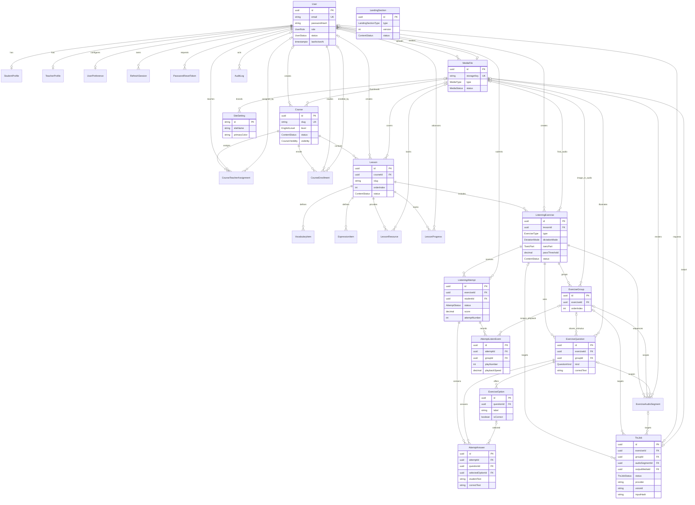

# ListenUp database ERD

The diagram focuses on ownership and historical relationships. Media has several named optional relations to content, and TTS output is represented as a media record.

```mermaid
erDiagram
  User ||--o| StudentProfile : has
  User ||--o| TeacherProfile : has
  User ||--o| UserPreference : configures
  User ||--o{ RefreshSession : owns
  User ||--o{ PasswordResetToken : requests
  User o|--o{ MediaFile : uploads
  MediaFile o|--o{ User : avatars

  User o|--o{ Course : creates
  Course ||--o{ CourseTeacherAssignment : assigns
  User ||--o{ CourseTeacherAssignment : teaches
  User o|--o{ CourseTeacherAssignment : assigned_by
  Course ||--o{ CourseEnrollment : enrolls
  User ||--o{ CourseEnrollment : studies
  User o|--o{ CourseEnrollment : enrolled_by
  MediaFile o|--o{ Course : thumbnails

  Course ||--o{ Lesson : contains
  User o|--o{ Lesson : creates
  MediaFile o|--o{ Lesson : covers
  Lesson ||--o{ VocabularyItem : defines
  Lesson ||--o{ ExpressionItem : defines
  Lesson ||--o{ LessonResource : provides
  MediaFile o|--o{ LessonResource : backs
  Lesson ||--o{ LessonProgress : tracks
  User ||--o{ LessonProgress : advances

  Lesson ||--o{ ListeningExercise : includes
  User o|--o{ ListeningExercise : creates
  MediaFile o|--o{ ListeningExercise : final_audio
  ListeningExercise ||--o{ ExerciseGroup : groups
  ListeningExercise ||--o{ ExerciseQuestion : asks
  ExerciseGroup o|--o{ ExerciseQuestion : shares_stimulus
  MediaFile o|--o{ ExerciseGroup : image_or_audio
  MediaFile o|--o{ ExerciseQuestion : illustrates
  ExerciseQuestion ||--o{ ExerciseOption : offers

  ListeningExercise ||--o{ ExerciseAudioSegment : sequences
  ExerciseGroup o|--o{ ExerciseAudioSegment : scopes
  ExerciseQuestion o|--o{ ExerciseAudioSegment : scopes
  MediaFile o|--o{ ExerciseAudioSegment : renders

  ListeningExercise ||--o{ ListeningAttempt : receives
  User ||--o{ ListeningAttempt : submits
  ListeningAttempt ||--o{ AttemptAnswer : contains
  ExerciseQuestion ||--o{ AttemptAnswer : answers
  ExerciseOption o|--o{ AttemptAnswer : selected
  ListeningAttempt ||--o{ AttemptListenEvent : records
  ExerciseGroup o|--o{ AttemptListenEvent : scopes_playback

  ListeningExercise o|--o{ TtsJob : targets
  ExerciseGroup o|--o{ TtsJob : targets
  ExerciseAudioSegment o|--o{ TtsJob : targets
  User o|--o{ TtsJob : requests
  MediaFile o|--o| TtsJob : output

  MediaFile o|--o{ SiteSetting : brands
  User o|--o{ AuditLog : acts

  User {
    uuid id PK
    string email UK
    string passwordHash
    UserRole role
    UserStatus status
    timestamptz lastActiveAt
  }
  Course {
    uuid id PK
    string slug UK
    EnglishLevel level
    ContentStatus status
    CourseVisibility visibility
  }
  Lesson {
    uuid id PK
    uuid courseId FK
    string slug
    int orderIndex
    ContentStatus status
  }
  ListeningExercise {
    uuid id PK
    uuid lessonId FK
    ExerciseType type
    DictationMode dictationMode
    ToeicPart toeicPart
    decimal passThreshold
    ContentStatus status
  }
  ExerciseGroup {
    uuid id PK
    uuid exerciseId FK
    int orderIndex
  }
  ExerciseQuestion {
    uuid id PK
    uuid exerciseId FK
    uuid groupId FK
    QuestionKind kind
    string correctText
  }
  ExerciseOption {
    uuid id PK
    uuid questionId FK
    string label
    boolean isCorrect
  }
  ListeningAttempt {
    uuid id PK
    uuid exerciseId FK
    uuid studentId FK
    AttemptStatus status
    decimal score
    int attemptNumber
  }
  AttemptListenEvent {
    uuid id PK
    uuid attemptId FK
    uuid groupId FK
    int playNumber
    decimal playbackSpeed
  }
  AttemptAnswer {
    uuid id PK
    uuid attemptId FK
    uuid questionId FK
    uuid selectedOptionId FK
    string studentText
    string correctText
  }
  MediaFile {
    uuid id PK
    string storageKey UK
    MediaType type
    MediaStatus status
  }
  TtsJob {
    uuid id PK
    uuid exerciseId FK
    uuid groupId FK
    uuid audioSegmentId FK
    uuid outputMediaId FK
    TtsJobStatus status
    string provider
    string voiceId
    string inputHash
  }
  LandingSection {
    uuid id PK
    LandingSectionType type
    int version
    ContentStatus status
  }
  SiteSetting {
    string id PK
    string siteName
    string primaryColor
  }
```
